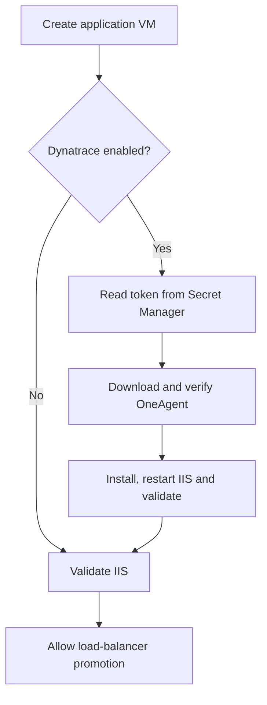

# GCP Windows image and GitOps blue/green pipeline

This repository builds a Windows Server 2022 Compute Engine image without
Packer. GitHub Actions validates pull requests and starts image builds and
environment deployments by submitting them to Cloud Build with Workload
Identity Federation. Cloud Build creates a temporary Windows VM in GCP,
uses a minimal PowerShell
metadata startup script to bootstrap OpenSSH, then provisions and smoke-tests
it over an ephemeral Ed25519 SSH key through IAP. It creates a versioned image
and cleans up temporary resources. It also contains a versioned IIS demo
application and two separately managed GitOps blue/green environments:
Development with two IIS worker nodes and Production with four.

## Architecture

```mermaid
flowchart TD
  classDef linux fill:#eaf2ff,stroke:#2357a6,stroke-width:2px,color:#111;
  classDef windows fill:#eafaf1,stroke:#216e3a,stroke-width:2px,color:#111;
  classDef gcp fill:#fff5e6,stroke:#b05a00,stroke-width:2px,color:#111;

  subgraph GH["GitHub Actions"]
    direction TB
    A["Pull request"]:::linux --> B["Run repository validation"]:::linux
    C["Application push to main"]:::linux --> C1["Start image build"]:::linux
    D["Dev or Prod manifest push"]:::linux --> D1["Start environment deployment"]:::linux
  end

  C1 --> CB["Submit Cloud Build job using Workload Identity Federation"]:::gcp
  D1 --> CB
  CB --> WCB["Cloud Build creates Windows builder VM in GCP"]:::gcp
  WCB --> P0["Startup script enables OpenSSH and authorizes temp key"]:::windows

  subgraph WIN["Windows builder VM: runs the image build and smoke tests"]
    direction TD
    P0 --> P0A["Copy bootstrap.ps1 over SSH"]:::windows
    P0A --> P1["PowerShell stage 1/9\nInstall IIS and publish app"]:::windows
    P1 --> P2["PowerShell stage 2/9\nInstall Git for Windows"]:::windows
    P2 --> P3["PowerShell stage 3/9\nInstall pinned .NET 7 SDK"]:::windows
    P3 --> P4["PowerShell stage 4/9\nInstall .NET 8 SDK"]:::windows
    P4 --> P5["PowerShell stage 5/9\nInstall Visual Studio 2022"]:::windows
    P5 --> P5A{"Installation mode?"}:::windows
    P5A -- "web-buildtools" --> P5B["Install VS Build Tools"]:::windows
    P5A -- "offline-iso" --> P5C["Install from mounted ISO"]:::windows
    P5C --> P5D["Read product key from Secret Manager"]:::windows
    P5D --> P5E["Complete install and dismount ISO"]:::windows
    P5A -- "disabled" --> P5F["Skip VS install"]:::windows
    P5B --> P5G["Validate MSBuild and devenv.exe"]:::windows
    P5E --> P5G
    P5F --> P6
    P5G --> P6["PowerShell stage 6/9\nRun project setup and validation hooks"]:::windows
    P6 --> P7["PowerShell stage 7/9\nStage pinned GitHub Actions runner binaries"]:::windows
    P7 --> P8["PowerShell stage 8/9\nVerify installed tools and HTTP health"]:::windows
    P8 --> P9["PowerShell stage 9/9\nSysprep and shut down VM"]:::windows
  end

  P9 --> Q["Capture immutable Windows image"]:::gcp
  Q --> S["Boot smoke-test VM from captured image"]:::windows

  subgraph SMOKE["Smoke-test VM: Windows validation only"]
    direction TD
    S --> S1["Smoke stage 1/4\nVerify IIS, app files and image proof"]:::windows
    S1 --> S2["Smoke stage 2/4\nRun Git, dotnet and MSBuild checks"]:::windows
    S2 --> S3["Smoke stage 3/4\nExecute SevenDemo when enabled"]:::windows
    S3 --> S4["Smoke stage 4/4\nRequest IIS health endpoint"]:::windows
    S4 --> S5["SMOKE_TEST_PASS"]:::windows
  end

  S5 --> T["Publish immutable image name\nremove temporary build resources"]:::gcp
  T --> U["Review and update the target\nDev or Prod deployment manifest"]:::linux
  U --> DEVACTIONS["Deploy development workflow"]:::linux
  U --> PRODACTIONS["Deploy production workflow"]:::linux
  DEVACTIONS --> DEVBUILD["Submit Dev reconciliation to Cloud Build"]:::gcp
  PRODACTIONS --> PRODBUILD["Submit Prod reconciliation to Cloud Build"]:::gcp
  DEVBUILD --> DEVNODES["Dev: create 2 IIS worker nodes\nand use Dev load balancer"]:::windows
  PRODBUILD --> PRODNODES["Prod: create 4 IIS worker nodes\nand use Prod load balancer"]:::windows
  DEVNODES --> DX{"Dynatrace enabled?"}:::gcp
  PRODNODES --> DX
  DX -- "No" --> H["Verify all workers\nand route the selected color"]:::gcp
  DX -- "Yes" --> DY["Install OneAgent on runtime VMs"]:::gcp
  DY --> H
  H --> I["Publish the environment-specific\nHTTP load-balancer endpoint"]:::gcp
  I --> J["10-minute viewing and validation window"]:::gcp
  J --> K["Tear down that environment's\nworker nodes and disks"]:::gcp
```



GitHub Actions starts image builds and environment deployments in Cloud Build
using Workload Identity Federation. It reports the Cloud Build result in the
workflow status and conclusion. Image creation, application installation, and
smoke tests run inside temporary GCP Windows VMs.

Git is the source of truth. `environments/dev/deployment.env` and
`environments/prod/deployment.env` separately record each environment's worker
count, active color, and immutable image/application version for both colors.
Dev provisions two IIS workers; Prod provisions four. Each environment has its
own GitHub Actions workflow, backend service, health check, and public endpoint.
Reverting that environment's manifest promotion requests rollback to its
previous color.

## Repository layout

The repository is organized by responsibility:

```text
bootstrap/              Developer, Cloud Build, and Visual Studio setup
cloudbuild/             Cloud Build pipeline entry points
infrastructure/
  image/                 Windows image build and smoke-test automation
  deployment/            Blue/green deployment and teardown
  networking/             Load-balancer and network setup
applications/sample/     Sample application and Windows setup/validation hooks
environments/
  dev/                     Two IIS worker nodes
  prod/                    Four IIS worker nodes
integrations/            Optional runtime integrations
validation/              Repository syntax and lint checks
docs/                    Architecture and operating documentation
tools/                   Supporting utilities
```
## Included software

  licensed full Visual Studio 2022 edition installed from mounted offline media

No GitHub registration token or other reusable secret is placed in the image.
Register each runner at instance startup with a short-lived token.

## Prerequisites

### Required Google Cloud APIs

Enable these APIs in the project:

`cloudbuild.googleapis.com`, `compute.googleapis.com`, `iam.googleapis.com`,
`iamcredentials.googleapis.com`, `iap.googleapis.com`,
`secretmanager.googleapis.com`, `storage.googleapis.com`, and
`sts.googleapis.com`.

```bash
gcloud services enable \
  cloudbuild.googleapis.com compute.googleapis.com iam.googleapis.com \
  iamcredentials.googleapis.com iap.googleapis.com \
  secretmanager.googleapis.com storage.googleapis.com sts.googleapis.com \
  --project=PROJECT_ID
```

1. Select a dedicated Cloud Build service account.
2. Grant that account enough access to create/delete instances, templates,
   managed instance groups, health checks, firewall rules, load-balancer
   resources, disks and images. For an MVP, `roles/compute.instanceAdmin.v1`
   plus the permissions required to create global load-balancer resources is
  the simplest starting point. It also needs Cloud Logging write access,
  IAP tunnel access, and `iam.serviceAccountUser` on any builder or runtime
  service accounts it must attach. Replace broad roles with a custom role for
  production. The administrator configuring Workload Identity Federation needs
  permission to manage the pool, provider, and service-account bindings.
3. Ensure quota for one `n2-standard-8` builder, one `e2-standard-4`
   smoke-test VM, and six `e2-standard-2` IIS workers (four Prod plus two Dev)
   with 200 GB balanced disks. Blue/green rollouts temporarily overlap old and
   new workers, so allow for up to twelve runtime VMs during concurrent
   deployments. Each environment also needs a global load balancer.
4. Grant the GitHub Actions submitter service account permission to submit
   Cloud Build jobs and act as the dedicated Cloud Build execution service
   account. Configure the repository-restricted Workload Identity Federation
   trust described below; do not create or upload a service-account key.
5. Ensure the selected subnet permits outbound HTTPS. The MVP uses ephemeral
   external IP addresses; replace those with a private subnet plus Cloud NAT
   for an enterprise implementation.

## Run it through GitHub Actions and Cloud Build

The default mode installs the full Visual Studio 2022 Community IDE directly
from Microsoft's web installer, so no ISO, media bucket, product key, or
additional builder service account is required. Configure GitHub Actions
authentication as described below. The workflows submit builds from the
checked-out repository to Cloud Build; no Cloud Build GitHub App or native
Cloud Build triggers are needed.

The `Validate repository` workflow runs on pull requests. Merging a matching
application change to `main` starts the `Build Windows image` workflow, which
submits the image config to Cloud Build and waits for the result. Its GitHub
Actions run reports queued/in-progress/completed status and a success or failure
conclusion, while streaming the Cloud Build logs. The logs contain the
immutable image name. After the image passes its smoke test, the workflow also
retrieves the published SevenDemo ZIP from the staging bucket, wraps it in a
versioned NuGet package, and pushes that package to GitHub Packages using the
workflow's `GITHUB_TOKEN`. Update the inactive color's image and version plus
`ACTIVE_COLOR` in the target environment's manifest, then submit that change as
a reviewed pull request. A matching manifest push starts that environment's
deployment workflow; Dev and Prod run independently using the `NODE_COUNT` in
each manifest (2 and 4 respectively). Each demo endpoint is available for the
configured viewing window, after which that environment's worker VMs are
removed. The separate load balancer frontends remain ready for the next run.
Each workflow's conclusion summary identifies the project and result, warns
about resources that persist after teardown, and prints the IAP tunnel command
for the management station when its environment flag is enabled.
Protect `main` and require pull-request validation and human approval before
allowing deployment-state changes.

### GitHub Actions authentication setup

All authenticated workflows use Workload Identity Federation; no
service-account key is stored in GitHub. Create a dedicated service account
for GitHub Actions to submit builds. Give it only permission to submit builds,
use the project, stage build sources and download the staged demo artifact, and
act as the Cloud Build execution service account:

```bash
PROJECT_ID=your-project-id
PROJECT_NUMBER="$(gcloud projects describe "$PROJECT_ID" --format='value(projectNumber)')"
GITHUB_ACTIONS_SA="github-actions-submitter@${PROJECT_ID}.iam.gserviceaccount.com"
CLOUD_BUILD_SA="your-cloud-build-service-account@${PROJECT_ID}.iam.gserviceaccount.com"
GCP_BUILD_SOURCE_BUCKET="${PROJECT_ID}-github-build-source"
GITHUB_REPOSITORY="Deck-J/GCP_Windows_GitOps_Demo"

gcloud services enable iam.googleapis.com iamcredentials.googleapis.com sts.googleapis.com \
  cloudbuild.googleapis.com --project="$PROJECT_ID"
gcloud iam service-accounts create github-actions-submitter --project="$PROJECT_ID"
gcloud storage buckets create "gs://${GCP_BUILD_SOURCE_BUCKET}" \
  --project="$PROJECT_ID" --location=us-central1 --uniform-bucket-level-access
gcloud storage buckets add-iam-policy-binding "gs://${GCP_BUILD_SOURCE_BUCKET}" \
  --member="serviceAccount:${GITHUB_ACTIONS_SA}" \
  --role=roles/storage.objectCreator
gcloud storage buckets add-iam-policy-binding "gs://${GCP_BUILD_SOURCE_BUCKET}" \
  --member="serviceAccount:${GITHUB_ACTIONS_SA}" \
  --role=roles/storage.objectViewer
gcloud storage buckets add-iam-policy-binding "gs://${GCP_BUILD_SOURCE_BUCKET}" \
  --member="serviceAccount:service-${PROJECT_NUMBER}@gcp-sa-cloudbuild.iam.gserviceaccount.com" \
  --role=roles/storage.objectViewer
gcloud storage buckets add-iam-policy-binding "gs://${GCP_BUILD_SOURCE_BUCKET}" \
  --member="serviceAccount:${CLOUD_BUILD_SA}" \
  --role=roles/storage.objectCreator
gcloud projects add-iam-policy-binding "$PROJECT_ID" \
  --member="serviceAccount:${GITHUB_ACTIONS_SA}" \
  --role=roles/cloudbuild.builds.editor
gcloud projects add-iam-policy-binding "$PROJECT_ID" \
  --member="serviceAccount:${GITHUB_ACTIONS_SA}" \
  --role=roles/serviceusage.serviceUsageConsumer
gcloud iam service-accounts add-iam-policy-binding "$CLOUD_BUILD_SA" \
  --project="$PROJECT_ID" \
  --member="serviceAccount:${GITHUB_ACTIONS_SA}" \
  --role=roles/iam.serviceAccountUser

gcloud iam workload-identity-pools create github-actions \
  --project="$PROJECT_ID" --location=global
gcloud iam workload-identity-pools providers create-oidc github \
  --project="$PROJECT_ID" --location=global \
  --workload-identity-pool=github-actions \
  --issuer-uri=https://token.actions.githubusercontent.com \
  --attribute-mapping="google.subject=assertion.sub,attribute.repository=assertion.repository" \
  --attribute-condition="assertion.repository == '${GITHUB_REPOSITORY}' && assertion.ref == 'refs/heads/main'"
gcloud iam service-accounts add-iam-policy-binding "$GITHUB_ACTIONS_SA" \
  --project="$PROJECT_ID" \
  --member="principalSet://iam.googleapis.com/projects/${PROJECT_NUMBER}/locations/global/workloadIdentityPools/github-actions/attribute.repository/${GITHUB_REPOSITORY}" \
  --role=roles/iam.workloadIdentityUser
```

In the GitHub repository, add these **Actions variables** under
**Settings → Secrets and variables → Actions → Variables**:

| Variable | Value |
| --- | --- |
| `GCP_PROJECT_ID` | The Google Cloud project ID |
| `GCP_BUILD_SOURCE_BUCKET` | The source staging bucket name, without `gs://` |
| `GCP_WIF_PROVIDER` | `projects/PROJECT_NUMBER/locations/global/workloadIdentityPools/github-actions/providers/github` |
| `GCP_WIF_SERVICE_ACCOUNT` | The `github-actions-submitter` service-account email |
| `CLOUD_BUILD_SERVICE_ACCOUNT` | The Cloud Build execution service-account email |
| `DEV_MANAGEMENT_STATION_ENABLED` | `true` to deploy the persistent Dev management station; defaults to `false` |
| `PROD_MANAGEMENT_STATION_ENABLED` | `true` to deploy the persistent Prod management station; defaults to `false` |

The provider condition restricts identity federation to this repository's
`main` branch. Build and deployment workflows run on matching pushes to
`main` and can also be started manually from the Actions tab with `main`
selected. Repository validation runs directly in GitHub Actions and does not
need GCP credentials.

The GitHub Actions submitter needs object-creator access to stage Cloud Build
sources and object-viewer access to retrieve the validated SevenDemo ZIP.
The Cloud Build execution service account needs object-creator access to stage
that ZIP. The workflow also needs the `packages: write` permission to publish
to the repository's GitHub Packages NuGet registry; this is granted through
the automatically provided `GITHUB_TOKEN`, not a personal access token.

### GitHub Actions run control

Before enabling the workflows, delete any existing Cloud Build GitHub triggers
for image builds, pull-request validation, or Dev/Prod deployment to prevent
duplicate runs. Configure optional image and deployment settings as GitHub
repository Actions variables; the workflows map those values to Cloud Build
substitutions. Keep credentials and the Dynatrace token value out of variables:
use Workload Identity Federation and Secret Manager.

Create the two environment-specific load balancers once:

```bash
./infrastructure/networking/setup-load-balancer.sh \
  PROJECT_ID us-central1-a dev-iis-demo environments/dev/deployment.env
./infrastructure/networking/setup-load-balancer.sh \
  PROJECT_ID us-central1-a prod-iis-demo environments/prod/deployment.env
```

The setup is idempotent. It gives Dev and Prod separate health checks, backend
services, addresses, HTTP frontends, and health-check firewall rules.

To rerun a build or deployment manually, open the relevant workflow in the
GitHub Actions tab, choose **Run workflow**, and select `main`. The run remains
in progress while Cloud Build executes; its final conclusion reflects the
Cloud Build result.

## Reusing the framework for another project

The repository separates infrastructure automation from application-owned
Windows installation and validation. The infrastructure code owns Cloud Build, temporary
VMs, image capture, runner staging, smoke-test markers, blue/green deployment,
and cleanup. A project supplies its version file plus two PowerShell hooks.

1. Copy this repository and edit `applications/sample/project.json`:

  ```json
  {
    "mode": "custom",
    "versionFile": "applications/sample/VERSION",
    "setupScript": "applications/sample/setup.ps1",
    "validateScript": "applications/sample/validate.ps1",
    "healthPath": "/health",
    "healthPort": 80
  }
  ```

2. Replace `applications/sample/setup.ps1` with the project installation hook. It receives
  `BuildRoot`, `InstallRoot`, `AppVersion`, and `SourceRevision`. Install the
  application and its dependencies there; retrieve sensitive values from
  Secret Manager rather than embedding them in the script.

3. Replace `applications/sample/validate.ps1` with the project image proof. It receives
  `InstallRoot` and `AppVersion` and must return a nonzero exit code when the
  application cannot run. The framework then checks the configured health URL,
  captures the image, and runs the same proof in the smoke-test VM.

The built-in `sample` mode remains available as a reference implementation for
IIS, Visual Studio, .NET, and SevenDemo. Custom mode does not require the sample
HTML or SevenDemo files; it requires the project hooks and a reachable health
endpoint after setup.

The Visual Studio offline ISO cannot be created in a Linux-based shell because
the included media-building script uses Windows ADK `oscdimg.exe`. Create that
ISO once on a Windows administration machine, upload it to the restricted GCS
bucket, and then perform the remaining build and deployment operations from the
configured environment.

The application version supplied to Cloud Build must match `applications/sample/VERSION`.
Application HTML is encoded into temporary VM metadata and installed into IIS;
the resulting image is named deterministically from the version and Git commit.

## Visual Studio 2022 installation modes

The default `web-community` mode downloads the Visual Studio 2022 Community
bootstrapper and installs the components in `applications/sample/config/vs2022.vsconfig`.
It installs the full IDE, including `devenv.exe`, and is the recommended path
when an ISO is not available. It requires outbound HTTPS from the temporary
Windows builder VM.

The `web-buildtools` mode remains available when only MSBuild is needed.

The optional `offline-iso` mode installs a full Visual Studio 2022 edition from
approved media when a full IDE demonstration is required. Enterprise and
Professional media additionally require a licensed product key.

```text
Restricted GCS bucket
VS 2022 Community layout ISO
          |
          Dedicated builder service account
                     |
                     v
          Temporary Windows builder VM
          1. Download ISO
          2. Mount ISO
          3. Run offline Community installer
          4. Compile .NET 7 / C# 7 demo with MSBuild
          5. Execute and validate compiled application
          6. Validate devenv.exe and MSBuild
          ### One-time administrator bootstrap
          8. Sysprep and capture image
          Configure the GitHub Actions Workload Identity Federation provider and repository variables described in the GitHub Actions authentication section.
Community Edition does not use a product key, so the default path does not
          GitHub Actions submits image and deployment jobs to Cloud Build. No native Cloud Build triggers are used.
`--productKey` installation parameter.
          GitHub Actions repository variables control the zone, Visual Studio installation mode, and optional Dynatrace settings. Keep secrets in Secret Manager rather than GitHub variables.
For unattended compilation where the IDE is unnecessary, Build Tools is usually
          ### 3. Run the full Visual Studio build through GitHub Actions

          Set the Visual Studio Actions variables, then merge an application change to `main` or manually run the image workflow from GitHub Actions.
.\tools\New-VS2022OfflineMedia.ps1 `
  -Edition Community `
  -LayoutPath C:\VS2022Layout `
  -IsoPath C:\VS2022Media\vs2022-community-layout.iso
          Manually run the production deployment workflow from GitHub Actions. Its run remains active until the Cloud Build deployment and teardown complete.

The script uses `applications/sample/config/vs2022.vsconfig`, verifies the layout, builds an ISO with
`oscdimg.exe`, and prints its SHA-256 hash. A complete layout can exceed 45 GB;
the included workload-specific configuration is substantially smaller. Keep the
path short because Microsoft recommends a layout path under 80 characters.

### 2. Create the restricted GCP resources

Run the setup script. Community mode creates no product-key secret:

```bash
./bootstrap/visual-studio/setup-demo.sh \
  PROJECT_ID \
  VS_MEDIA_BUCKET \
  CLOUD_BUILD_SERVICE_ACCOUNT_EMAIL \
  windows-image-builder \
  unused \
  community
```

Upload the resulting ISO:

```bash
gcloud storage cp C:\VS2022Media\vs2022-community-layout.iso \
  gs://VS_MEDIA_BUCKET/vs2022-community-layout.iso
```

The dedicated builder service account receives object-viewer access only on
that bucket. Cloud Build receives `iam.serviceAccountUser` only on the builder
identity. Enterprise and Professional setup additionally grants access to their
specific product-key secret.

### 3. Run the full Visual Studio build through GitHub Actions

To use non-default Visual Studio image-build settings, set repository Actions
variables `VS_INSTALL_MODE`, `VS_EDITION`, `VS_MEDIA_URI`,
`VS_PRODUCT_KEY_SECRET`, and `BUILDER_SERVICE_ACCOUNT`. Then merge an
application change to `main` or run the workflow manually from the Actions tab.

Supported modes:

| Mode | Behavior |
| --- | --- |
| `web-community` | Downloads and installs the full VS 2022 Community IDE; no ISO needed |
| `web-buildtools` | Downloads and installs VS 2022 Build Tools; no key needed |
| `offline-iso` | Downloads from GCS, mounts the ISO and installs full VS 2022 |
| `disabled` | Skips Visual Studio installation |

Supported full editions are `enterprise`, `professional`, and `community`.
Community does not request a product key. The ISO must contain the matching
bootstrapper at its layout root.

Visual Studio records its layout location for future servicing. These images
are treated as immutable: update the layout and rebuild the image instead of
modifying an existing image.

### Compiled SevenDemo proof

The source under `applications/sample/demo/SevenDemo` is part of the Git repository. Its project
file explicitly contains:

```xml
<TargetFramework>net7.0</TargetFramework>
<LangVersion>7.0</LangVersion>
```

The image build installs the pinned 7.0.410 SDK, invokes `devenv.com /Build
Release` against the sample project, publishes the application with the Visual
Studio MSBuild executable, and executes the result. Non-secret proof is written
to `C:\ImageMetadata\seven-demo-build.json`, with the `devenv.com` output in
`C:\ImageMetadata\seven-demo-devenv-build.log`. The smoke-test VM verifies that
the IDE build proof exists and executes the same compiled DLL again before the
image can be promoted.

When Visual Studio is enabled, the image-build workflow publishes the validated
`SevenDemo.zip` inside the NuGet package
`gcp-windows-gitops-demo-sevendemo`. Package versions combine the application
version with the unique Actions run number and attempt (for example,
`1.0.0-ci.42.1`), allowing repeated builds of the same app version to be
published separately. In GitHub Packages, use the NuGet registry for this
repository; the `.nupkg` contains the application archive at
`tools/SevenDemo.zip`. A build with `VS_INSTALL_MODE=disabled` skips package
publication because it does not produce the compiled demo.

View the [SevenDemo package in GitHub Packages](https://github.com/Deck-J/GCP_Windows_GitOps_Demo/pkgs/nuget/gcp-windows-gitops-demo-sevendemo).

### Conexus upload demonstration (mock)

After publishing to GitHub Packages, the image-build workflow runs a mock
Conexus handoff for `SevenDemo.zip`. It prints a simulated receipt with the
package version and ZIP SHA-256 in the GitHub Actions summary. This is
demonstration-only: it does not connect to Conexus, transmit the file, require
an endpoint, or use credentials. Replace this step with your enterprise
Conexus upload command and approved authentication when the target repository
details are available.

.NET 7 is out of support, so this target is appropriate for demonstrating the
requested legacy toolchain, not for a new production application.

Visual Studio Community is free but is not unrestricted for organizational or
enterprise use. Confirm that this demonstration fits the applicable Community
license terms; otherwise switch the image build pipeline to a properly licensed
Professional or Enterprise edition.

On success, the final log lines print `IMAGE_NAME` and `IMAGE_FAMILY`. Consumers
should normally reference the image family `windows-github-runner`, while image
names provide immutable build versions.

## Optional Dynatrace OneAgent integration

Dynatrace is disabled by default. When enabled, OneAgent is installed at runtime
on every IIS worker in the blue or green application group. It is not activated in the
golden image, builder VM or smoke-test VM, which prevents clones from inheriting
the same agent identity.



Create an access token in Dynatrace with only the `InstallerDownload` scope.
Run the setup from an administrator environment. Set the printed
`DYNATRACE_*` Actions variables for both deployment workflows:

```bash
./integrations/dynatrace/setup-dynatrace.sh \
  PROJECT_ID \
  https://ENVIRONMENT_ID.live.dynatrace.com \
  dynatrace-installer-token \
  dynatrace-demo-runtime \
  CLOUD_BUILD_SERVICE_ACCOUNT_EMAIL
```

The script securely prompts for the token, stores it in Secret Manager, creates
or reuses a dedicated runtime service account, grants that identity access only
to the selected secret, and allows the Cloud Build execution service account to
attach the identity. It never prints the token or stores it in Git, GitHub
Actions variables, the custom image, or VM metadata.

Configure the repository variables printed by the setup script:

| Variable | Default | Purpose |
| --- | --- | --- |
| `DYNATRACE_ENABLED` | `false` | Enables optional OneAgent installation |
| `DYNATRACE_ENVIRONMENT_URL` | `disabled` | Dynatrace SaaS environment URL |
| `DYNATRACE_TOKEN_SECRET` | `disabled` | Secret Manager secret name, not its value |
| `DYNATRACE_RUNTIME_SERVICE_ACCOUNT` | `disabled` | Identity attached to runtime IIS VMs |
| `DYNATRACE_MONITORING_MODE` | `fullstack` | `fullstack`, `infra-only`, or `discovery` |
| `DYNATRACE_HOST_GROUP` | `gcp-windows-demo` | Host group shown in Dynatrace |
| `DYNATRACE_NETWORK_ZONE` | `disabled` | Optional ActiveGate/network zone |

The runtime script validates the downloaded executable's Authenticode signer,
installs OneAgent silently, applies application/color/version/ephemeral
metadata, restarts IIS, and checks both the OneAgent Windows service and the IIS
health endpoint. Every VM in the target worker group must emit `DYNATRACE_READY` before
traffic can switch. `DYNATRACE_FAILED` fails the promotion and the standard
failure teardown still runs.

See `integrations/dynatrace/README.md` for the focused module documentation.

## Failure behavior

- Provisioning has a 105-minute bound; smoke testing has a 15-minute bound.
- `IMAGE_BUILD_FAILED:` and `SMOKE_TEST_FAIL:` markers fail the build quickly.
- `DYNATRACE_FAILED:` blocks traffic promotion when the optional integration is enabled.
- The exit trap deletes temporary VMs on success or failure.
- A failed candidate image is deleted.
- Set the `KEEP_FAILED_VM` Actions variable to `true` to preserve temporary VMs for debugging. Remember
  to delete them manually afterward.
- The deployment build preserves its success or failure result, waits 600
  seconds, and then runs the same idempotent runtime teardown in either case.
- Teardown removes that environment's blue/green worker groups and their disks.
  Its environment-specific HTTP load balancer, reserved frontend address,
  health check, and firewall rule remain ready for the next run. It
  does not delete the reusable custom image, Visual Studio ISO, source
  repository, logs, or secrets.

## Console output and run summaries

The image and environment deployment pipelines are formatted for a live demonstration:

- GitHub Actions shows each workflow's queued, in-progress, and completed
  state, with the final success or failure conclusion. Cloud Build output is
  streamed into the workflow log and retained in Cloud Logging.
- Cloud Build prints UTC timestamps plus numbered `PIPELINE`, `STAGE`, `DEPLOY`,
  `DYNATRACE`, `DEMO`, and `TEARDOWN` messages.
- OpenSSH is bootstrapped by the Windows startup script; provisioning and smoke
  test output stream through the IAP SSH session. Visual Studio media download,
  mounting, installation, MSBuild compilation, SevenDemo execution, IIS checks,
  smoke tests and Sysprep are individually visible.
- Successful checks print `[PASS]`; failures print `[FAIL]` and propagate a
  nonzero build status.
- The 10-minute demonstration window prints a heartbeat every 60 seconds.
- Build logs include the immutable image name, environment-specific validation
  URL, and teardown status for the corresponding pipeline.

## GitOps blue/green pipeline

The deployment manifest is the reviewed source of truth. No CI identity writes
back to GitHub or creates promotion pull requests.

1. Change `applications/sample/src/index.html` or `applications/sample/src/health.html` and increment
  `applications/sample/VERSION`.
2. Merge the application change to `main`.
3. The `Build Windows image` GitHub Actions workflow submits a Cloud Build
  job that creates and smoke-tests an immutable Windows image. Copy its image
  name from the Cloud Build logs linked from the Actions run.
4. Update the inactive color's image and version in
  `environments/dev/deployment.env`, and set `ACTIVE_COLOR` to that color.
   Dev has `NODE_COUNT=2`; both IIS workers must pass health checks.
5. Open and review a pull request containing the Dev manifest change. Merging
  it starts the `Deploy development` workflow.
6. After Dev validation, promote the same image by updating the inactive color
  in `environments/prod/deployment.env`. Prod has `NODE_COUNT=4`.
7. Review and merge the Prod manifest change to start the `Deploy production`
  workflow. Each environment has its own load balancer, health check, and address.
8. Each endpoint remains available for 10 minutes after validation. Teardown
  removes that environment's workers on success or failure but leaves its
  load balancer ready for the next run. The manifests and immutable image
  remain available for subsequent deployments.

The first deployment seeds one color, so it has no preexisting rollback color.
After the next successful promotion, both blue and green are populated.

### Manual reconciliation

Run the corresponding deployment workflow manually from the GitHub Actions
tab after selecting the `main` branch.

A successful deployment is reported only after the 10-minute viewing window
and worker teardown complete. If deployment or validation fails, cleanup still
runs and the original failure is returned.

### Optional RDP management station

Set `DEV_MANAGEMENT_STATION_ENABLED=true` or
`PROD_MANAGEMENT_STATION_ENABLED=true` in GitHub Actions repository variables
to enable a persistent Windows Server 2022 management station for that
environment. The next deployment creates the station without an external IP,
allows inbound RDP to it only from Google's IAP TCP forwarding range, and
allows worker RDP only from the station's network tag. It prints the station
name, private IP, and IAP tunnel command in the deployment logs. Leave the
flag unset or set it to `false` to remove that environment's station and RDP
firewall rules on its next deployment.

An authorized operator needs IAP TCP forwarding access and permission to
reset Windows passwords. Run these commands from an authenticated administrator
terminal, not from GitHub Actions; the generated passwords are sensitive:

```bash
gcloud compute reset-windows-password dev-iis-demo-management \
  --project=PROJECT_ID --zone=ZONE --user=gitops-admin
gcloud compute start-iap-tunnel dev-iis-demo-management 3389 \
  --local-host-port=localhost:3389 --project=PROJECT_ID --zone=ZONE
```

Connect an RDP client to `localhost:3389`. From the station, RDP to a worker's
private IP. Reset a Windows password for each worker from the administrator
terminal when needed; never put generated passwords in Actions variables or
build logs. The application's workers retain their normal 10-minute demo
teardown, so the management station remains available but worker RDP is only
possible while that deployment's workers are running. The persistent Windows
station continues to incur compute and disk charges until a deployment runs
with its flag disabled.

The one-time networking setup creates a dedicated MVP HTTP load balancer for
each environment. Deployment logs print the selected environment's public IP.
Use HTTPS, a managed certificate, a custom VPC and restricted administration
paths before exposing a real application.

## Intentional MVP limits

- Visual Studio workload selection is controlled by `applications/sample/config/vs2022.vsconfig`;
  add components only when a build proves they are needed.
- Crystal Reports is not installed because its MSI and license source are
  organization-specific. Add it to `bootstrap.ps1` after placing the installer
  in an approved artifact repository.
- The GitHub runner is staged but not configured. Registration belongs in the
  runtime VM startup process, not image creation.
- Serial-console scanning is deliberately simple. At larger scale, publish
  structured status to Cloud Logging and add log-based metrics.
- The public download URLs should be replaced with approved internal artifact
  mirrors and checksums before production use.
- The demo uses zonal blue and green unmanaged worker groups and HTTP
  frontends. A production design should use regional managed instance groups
  across multiple zones and HTTPS.

## Production hardening follow-ups

- Use a custom IAM role instead of broad Compute Instance Admin.
- Attach a minimal dedicated VM service account.
- Remove external IPs and use Private Google Access plus Cloud NAT/proxy.
- Verify SHA-256 checksums for every downloaded installer.
- Add Shielded VM settings, vulnerability scanning and image deprecation.
- Promote tested images between candidate and production projects.
- Add an image-retention job that keeps the newest approved versions.
