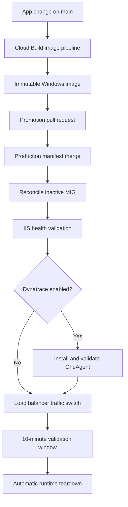
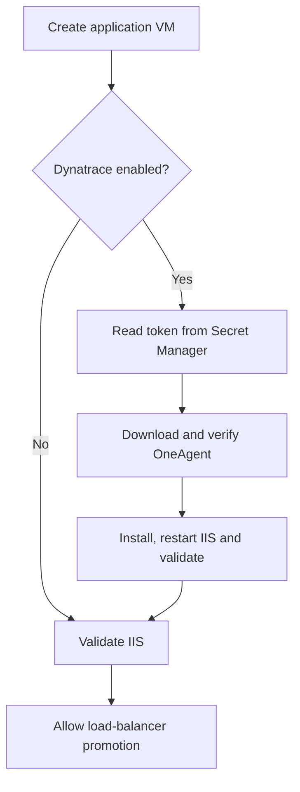

# GCP Windows image and GitOps blue/green pipeline

This repository builds a Windows Server 2022 Compute Engine image without
Packer. Cloud Build creates a temporary VM, provisions it with a PowerShell
metadata startup script, waits for a serial-console completion marker and
Sysprep shutdown, creates a versioned image, boots a smoke-test VM, and cleans
up temporary resources. It also contains a versioned IIS demo application and
a GitOps blue/green deployment workflow for two managed instance groups.

## Architecture



Git is the source of truth. The file `environments/prod/deployment.env` records
the desired active color plus the immutable image and application version for
both colors. A deployment is requested by pull request, not by changing GCP
manually. Reverting the promotion commit requests rollback to the previous
color.

## Repository layout

The repository is organized by responsibility rather than by a single scripts
directory:

```text
framework/             Reusable bootstrap, image, deployment, and validation code
pipelines/             Cloud Build entry points
projects/sample/       Sample application, version, setup hook, and validation hook
integrations/          Optional runtime integrations such as Dynatrace
environments/          GitOps desired deployment state
docs/                  Architecture and operating documentation
```

For another application, copy `projects/sample/` to a project-specific folder,
replace its setup and validation hooks, and point the framework configuration
at that project. The framework folders should remain unchanged.

## Included software

- IIS with a small validation page
- Git for Windows
- Pinned .NET 7.0.410 SDK for the demonstration project
- .NET 8 SDK for current runner compatibility
- Visual Studio 2022 Build Tools, or a licensed full Visual Studio 2022 edition
  installed from mounted offline media
- Pinned GitHub Actions runner binaries (not registered)
- Versioned static IIS application from `projects/sample/src`
- Repository-stored `SevenDemo` project targeting .NET 7 and C# 7.0
- Optional runtime-only Dynatrace OneAgent integration

No GitHub registration token or other reusable secret is placed in the image.
Register each runner at instance startup with a short-lived token.

## Prerequisites

1. Enable the Compute Engine and Cloud Build APIs.
2. Select a dedicated Cloud Build service account.
3. Grant that account enough access to create/delete instances, templates,
   managed instance groups, health checks, firewall rules, load-balancer
   resources, disks and images. For an MVP, `roles/compute.instanceAdmin.v1`
   plus the permissions required to create global load-balancer resources is
   the simplest starting point. Replace this with a custom role for production.
4. Ensure the project has quota for one `n2-standard-8`, one `e2-standard-4`,
   Windows licensing and two 200 GB balanced persistent disks.
5. Ensure the selected subnet permits outbound HTTPS. The MVP uses ephemeral
   external IP addresses; replace those with a private subnet plus Cloud NAT
   for an enterprise implementation.

## Run it

The default mode is the mounted Visual Studio 2022 Community ISO demonstration.
Complete the media and service-account setup below, then run the documented
full build command. To run the smaller Build Tools path instead:

```bash
gcloud builds submit \
  --config=pipelines/cloudbuild-image.yaml \
  --substitutions=_ZONE=us-east1-b,_RUNNER_VERSION=2.328.0,_VS_INSTALL_MODE=web-buildtools \
  .
```

## GitHub Codespaces quick start

The repository includes `.devcontainer/devcontainer.json`, so Codespaces opens
with the Google Cloud CLI, GitHub CLI, PowerShell, ShellCheck, YAML validation,
ZIP tools and the recommended VS Code extensions already available. The
Codespace is the Linux control plane; Cloud Build creates the temporary Windows
VMs in GCP.

1. Extract this repository, create a GitHub repository from its contents and
   push the `main` branch.
2. In GitHub, select **Code**, **Codespaces**, **Create codespace on main**.
3. Wait for the post-create check to report `Codespace ready`.
4. Authenticate your own GCP identity without writing credentials into Git:

   ```bash
   gcloud auth login --no-launch-browser
   ```

5. Configure and check the selected project:

   ```bash
  ./framework/bootstrap/configure-codespace.sh PROJECT_ID us-central1-a
   ```

   The script creates an isolated local gcloud configuration, verifies project
   access, reports missing APIs, and prints the exact `gcloud services enable`
   command when action is required. It does not enable services or change IAM
   automatically.

6. Run the full repository validation at any time:

   ```bash
  ./framework/validation/validate-repository.sh
   ```

   The same commands are available through **Terminal > Run Task** as
   `Demo: Configure Codespace` and `Demo: Validate Repository`.

7. Configure the GitHub repository variables printed by
   `configure-codespace.sh`. GitHub Actions authenticates to GCP through
   Workload Identity Federation; do not add a downloaded service-account JSON
   key to the Codespace or repository.

### Bootstrap GitHub Actions authentication

The first GitHub Actions run needs a one-time trust relationship between the
repository and GCP. Run this from the Codespace after `gcloud auth login` and
`gh auth login`:

```bash
./framework/bootstrap/bootstrap-github-actions.sh PROJECT_ID us-central1-a
```

This creates the GitHub OIDC provider, a dedicated Cloud Build submitter
service account, the required IAM bindings and GitHub repository variables.
It is deliberately run with your existing administrator identity because a
workflow cannot authenticate through Workload Identity Federation before that
trust relationship exists. It does not create a reusable service-account key.

After it succeeds, pushes to `main` can build images and create promotion pull
requests through `build-app-image.yml`; merging a promotion pull request runs
`reconcile-production.yml`.

## Reusing the framework for another project

The repository separates framework-owned infrastructure from project-owned
Windows installation and validation. The framework owns Cloud Build, temporary
VMs, image capture, runner staging, smoke-test markers, blue/green deployment,
and cleanup. A project supplies its version file plus two PowerShell hooks.

1. Copy this repository and edit `projects/sample/project.json`:

  ```json
  {
    "mode": "custom",
    "versionFile": "projects/sample/VERSION",
    "setupScript": "projects/sample/setup.ps1",
    "validateScript": "projects/sample/validate.ps1",
    "healthPath": "/health",
    "healthPort": 80
  }
  ```

2. Replace `projects/sample/setup.ps1` with the project installation hook. It receives
  `BuildRoot`, `InstallRoot`, `AppVersion`, and `SourceRevision`. Install the
  application and its dependencies there; retrieve sensitive values from
  Secret Manager rather than embedding them in the script.

3. Replace `projects/sample/validate.ps1` with the project image proof. It receives
  `InstallRoot` and `AppVersion` and must return a nonzero exit code when the
  application cannot run. The framework then checks the configured health URL,
  captures the image, and runs the same proof in the smoke-test VM.

The built-in `sample` mode remains available as a reference implementation for
IIS, Visual Studio, .NET, and SevenDemo. Custom mode does not require the sample
HTML or SevenDemo files; it requires the project hooks and a reachable health
endpoint after setup.

The Visual Studio offline ISO cannot be created in the Linux Codespace because
the included media-building script uses Windows ADK `oscdimg.exe`. Create that
ISO once on a Windows administration machine, upload it to the restricted GCS
bucket, and then perform every remaining build and deployment operation from
Codespaces.

The application version supplied to Cloud Build must match `projects/sample/VERSION`.
Application HTML is encoded into temporary VM metadata and installed into IIS;
the resulting image is named deterministically from the version and Git commit.

## Visual Studio 2022 offline-install demonstration

The default `offline-iso` mode installs Visual Studio 2022 Community. The
`web-buildtools` mode remains available for a smaller build-runner image.
Enterprise and Professional media are also supported when a licensed-key
demonstration is required.

```text
Restricted GCS bucket
VS 2022 Community layout ISO
          |
          Dedicated builder service account
                     |
                     v
          Temporary Windows builder VM
          1. Download ISO
          2. Mount ISO
          3. Run offline Community installer
          4. Compile .NET 7 / C# 7 demo with MSBuild
          5. Execute and validate compiled application
          6. Validate devenv.exe and MSBuild
          7. Dismount and delete ISO
          8. Sysprep and capture image
```

Community Edition does not use a product key, so the default path does not
create or read a licensing secret. In the optional Enterprise/Professional
path, the product key is not committed to Git or placed in instance metadata.
It is read from Secret Manager and supplied to Microsoft's supported
`--productKey` installation parameter.

A product key is an activation mechanism, not proof of licensing entitlement.
Confirm with your Microsoft licensing team that the selected Enterprise or
Professional license permits the number of concurrently running image clones.
For unattended compilation where the IDE is unnecessary, Build Tools is usually
the simpler licensing and operational choice.

### 1. Create the offline layout ISO

On a licensed Windows administration machine with the Windows ADK Deployment
Tools installed, run:

```powershell
.\tools\New-VS2022OfflineMedia.ps1 `
  -Edition Community `
  -LayoutPath C:\VS2022Layout `
  -IsoPath C:\VS2022Media\vs2022-community-layout.iso
```

The script uses `projects/sample/config/vs2022.vsconfig`, verifies the layout, builds an ISO with
`oscdimg.exe`, and prints its SHA-256 hash. A complete layout can exceed 45 GB;
the included workload-specific configuration is substantially smaller. Keep the
path short because Microsoft recommends a layout path under 80 characters.

### 2. Create the restricted GCP resources

Run the setup script. Community mode creates no product-key secret:

```bash
./framework/bootstrap/setup-vs-demo.sh \
  PROJECT_ID \
  VS_MEDIA_BUCKET \
  CLOUD_BUILD_SERVICE_ACCOUNT_EMAIL \
  windows-image-builder \
  unused \
  community
```

Upload the resulting ISO:

```bash
gcloud storage cp C:\VS2022Media\vs2022-community-layout.iso \
  gs://VS_MEDIA_BUCKET/vs2022-community-layout.iso
```

The dedicated builder service account receives object-viewer access only on
that bucket. Cloud Build receives `iam.serviceAccountUser` only on the builder
identity. Enterprise and Professional setup additionally grants access to their
specific product-key secret.

### 3. Run the full Visual Studio build

```bash
gcloud builds submit \
  --config=pipelines/cloudbuild-image.yaml \
  --substitutions="_VS_INSTALL_MODE=offline-iso,_VS_EDITION=community,_VS_MEDIA_URI=gs://VS_MEDIA_BUCKET/vs2022-community-layout.iso,_VS_PRODUCT_KEY_SECRET=unused,_BUILDER_SERVICE_ACCOUNT=windows-image-builder@PROJECT_ID.iam.gserviceaccount.com" \
  .
```

For GitHub-triggered builds, configure repository variables with the same five
names without their leading underscores. The workflow passes them to Cloud
Build through Workload Identity Federation.

Supported modes:

| Mode | Behavior |
| --- | --- |
| `web-buildtools` | Downloads and installs VS 2022 Build Tools; no key needed |
| `offline-iso` | Downloads from GCS, mounts the ISO and installs full VS 2022 |
| `disabled` | Skips Visual Studio installation |

Supported full editions are `enterprise`, `professional`, and `community`.
Community does not request a product key. The ISO must contain the matching
bootstrapper at its layout root.

Visual Studio records its layout location for future servicing. These images
are treated as immutable: update the layout and rebuild the image instead of
modifying an existing runner VM.

### Compiled SevenDemo proof

The source under `projects/sample/demo/SevenDemo` is part of the Git repository. Its project
file explicitly contains:

```xml
<TargetFramework>net7.0</TargetFramework>
<LangVersion>7.0</LangVersion>
```

The image build installs the pinned 7.0.410 SDK, invokes the MSBuild executable
inside the Visual Studio installation, publishes the application, executes the
result and records non-secret build proof at
`C:\ImageMetadata\seven-demo-build.json`. The smoke-test VM executes the same
compiled DLL again before the image can be promoted.

.NET 7 is out of support, so this target is appropriate for demonstrating the
requested legacy toolchain, not for a new production application.

Visual Studio Community is free but is not unrestricted for organizational or
enterprise use. Confirm that this demonstration fits the applicable Community
license terms; otherwise switch the same workflow to a properly licensed
Professional or Enterprise edition.

On success, the final log lines print `IMAGE_NAME` and `IMAGE_FAMILY`. Consumers
should normally reference the image family `windows-github-runner`, while image
names provide immutable build versions.

## Optional Dynatrace OneAgent integration

Dynatrace is disabled by default. When enabled, OneAgent is installed at runtime
on the blue and green IIS application VMs only. It is not activated in the
golden image, builder VM or smoke-test VM, which prevents clones from inheriting
the same agent identity.



Create an access token in Dynatrace with only the `InstallerDownload` scope.
Then run the interactive setup from Codespaces:

```bash
./integrations/dynatrace/setup-dynatrace.sh \
  PROJECT_ID \
  https://ENVIRONMENT_ID.live.dynatrace.com \
  dynatrace-installer-token \
  dynatrace-demo-runtime \
  CLOUD_BUILD_SERVICE_ACCOUNT_EMAIL
```

The script securely prompts for the token, stores it in Secret Manager, creates
or reuses a dedicated runtime service account, grants that identity access only
to the selected secret, and allows Cloud Build to attach the identity. It never
prints the token or stores it in Git, GitHub variables, the custom image, or VM
metadata.

Configure the variables printed by the setup script:

| Variable | Default | Purpose |
| --- | --- | --- |
| `DYNATRACE_ENABLED` | `false` | Enables optional OneAgent installation |
| `DYNATRACE_ENVIRONMENT_URL` | `disabled` | Dynatrace SaaS environment URL |
| `DYNATRACE_TOKEN_SECRET` | `disabled` | Secret Manager secret name, not its value |
| `DYNATRACE_RUNTIME_SERVICE_ACCOUNT` | `disabled` | Identity attached to runtime IIS VMs |
| `DYNATRACE_MONITORING_MODE` | `fullstack` | `fullstack`, `infra-only`, or `discovery` |
| `DYNATRACE_HOST_GROUP` | `gcp-windows-demo` | Host group shown in Dynatrace |
| `DYNATRACE_NETWORK_ZONE` | `disabled` | Optional ActiveGate/network zone |

The runtime script validates the downloaded executable's Authenticode signer,
installs OneAgent silently, applies application/color/version/ephemeral
metadata, restarts IIS, and checks both the OneAgent Windows service and the IIS
health endpoint. Every VM in the target MIG must emit `DYNATRACE_READY` before
traffic can switch. `DYNATRACE_FAILED` fails the promotion and the standard
failure teardown still runs.

See `integrations/dynatrace/README.md` for the focused module documentation.

## Failure behavior

- Provisioning has a 105-minute bound; smoke testing has a 15-minute bound.
- `IMAGE_BUILD_FAILED:` and `SMOKE_TEST_FAIL:` markers fail the build quickly.
- `DYNATRACE_FAILED:` blocks traffic promotion when the optional integration is enabled.
- The exit trap deletes temporary VMs on success or failure.
- A failed candidate image is deleted.
- Set `_KEEP_FAILED_VM=true` to preserve temporary VMs for debugging. Remember
  to delete them manually afterward.
- The deployment build preserves its success or failure result, waits 600
  seconds, and then runs the same idempotent runtime teardown in either case.
- Teardown removes both demo MIGs and their disks, versioned instance templates,
  the HTTP load balancer, reserved frontend address, health check, and demo
  firewall rule. It does not delete the reusable custom image, Visual Studio
  ISO, source repository, logs, or secrets.

## Console output and run summaries

The image and deployment pipelines are formatted for a live demonstration:

- GitHub Actions displays numbered job steps and groups the detailed Cloud
  Build output into collapsible sections.
- Cloud Build prints UTC timestamps plus numbered `PIPELINE`, `STAGE`, `DEPLOY`,
  `DYNATRACE`, `DEMO`, and `TEARDOWN` messages.
- Windows startup-script progress is streamed from the serial console without
  repeatedly printing the full serial log. Visual Studio media download,
  mounting, installation, MSBuild compilation, SevenDemo execution, IIS checks,
  smoke tests and Sysprep are individually visible.
- Successful checks print `[PASS]`; failures print `[FAIL]`, propagate a
  nonzero status, and create a GitHub Actions error annotation.
- The 10-minute demonstration window prints a heartbeat every 60 seconds.
- Each GitHub workflow writes a Markdown run summary with the image, application
  version, target color, validation URL, validation result and teardown status.

## GitOps blue/green workflow

Configure these GitHub repository variables:

| Variable | Purpose |
| --- | --- |
| `GCP_PROJECT_ID` | Image and deployment project |
| `GCP_ZONE` | Zone for the blue and green managed instance groups |
| `GCP_WIF_PROVIDER` | GitHub-to-GCP Workload Identity provider |
| `GCP_SERVICE_ACCOUNT` | Service account impersonated by GitHub Actions |
| `DYNATRACE_ENABLED` | Optional OneAgent toggle; defaults to `false` |

The workflows require GitHub Actions permission to create branches and pull
requests. Protect the `production` GitHub environment if deployment approval is
required.

1. Change `projects/sample/src/index.html` or `projects/sample/src/health.html` and increment
  `projects/sample/VERSION`.
2. Merge the application change to `main`.
3. `build-app-image.yml` creates and smoke-tests an immutable Windows image.
4. The workflow opens a pull request that points the inactive color to the new
   image and makes it the desired active color.
5. Review and merge that promotion pull request.
6. `reconcile-production.yml` updates only that color, waits for the MIG,
   optional OneAgent readiness, and `/health.html`, and then switches backend
   capacity to it.
7. The public demo remains available for 10 minutes after validation.
8. The deployment build then removes both colors and all runtime networking,
   whether validation succeeded or failed. The Git manifest and immutable
   image remain available to rebuild the demonstration.

The first deployment seeds one color, so it has no preexisting rollback color.
After the next successful promotion, both blue and green are populated.

### Manual reconciliation

After putting a valid image in `environments/prod/deployment.env`:

```bash
gcloud builds submit --config=pipelines/cloudbuild-deploy.yaml .
```

The command remains active through the 10-minute viewing window and teardown.
For a shorter test, override the delay—for example,
`--substitutions=_TEARDOWN_DELAY_SECONDS=60`. A successful deployment is only
reported successful after teardown completes. If deployment or validation
fails, cleanup still runs and the original nonzero result is returned.

The deployment script creates the MVP HTTP load balancer and prints its public
IP. Use HTTPS, a managed certificate, a custom VPC and restricted administration
paths before exposing a real application.

## Intentional MVP limits

- Visual Studio workload selection is controlled by `projects/sample/config/vs2022.vsconfig`;
  add components only when a build proves they are needed.
- Crystal Reports is not installed because its MSI and license source are
  organization-specific. Add it to `bootstrap.ps1` after placing the installer
  in an approved artifact repository.
- The GitHub runner is staged but not configured. Registration belongs in the
  runtime VM startup process, not image creation.
- Serial-console scanning is deliberately simple. At larger scale, publish
  structured status to Cloud Logging and add log-based metrics.
- The public download URLs should be replaced with approved internal artifact
  mirrors and checksums before production use.
- The demo uses a zonal blue and green MIG and an HTTP frontend. A production
  design should use regional MIGs across multiple zones and HTTPS.

## Production hardening follow-ups

- Use a custom IAM role instead of broad Compute Instance Admin.
- Attach a minimal dedicated VM service account.
- Remove external IPs and use Private Google Access plus Cloud NAT/proxy.
- Verify SHA-256 checksums for every downloaded installer.
- Add Shielded VM settings, vulnerability scanning and image deprecation.
- Promote tested images between candidate and production projects.
- Add an image-retention job that keeps the newest approved versions.
