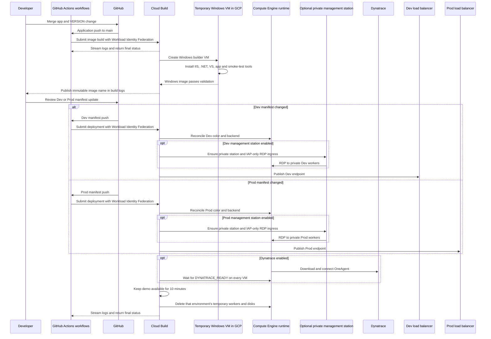

# GitOps blue/green design

## Control flow

GitHub Actions starts repository validation on pull requests and submits
matching image builds and reviewed deployments to Cloud Build. Workload
Identity Federation authenticates the submitter without a stored service
account key. Each Action waits for Cloud Build to finish and reports its final
success or failure through the GitHub Actions run. Image creation and image
smoke tests run inside temporary Windows VMs launched by Cloud Build.

## State ownership

| State | Authority |
| --- | --- |
| Application source and semantic version | `applications/sample/` in Git |
| Environment topology and desired images | `environments/dev/` and `environments/prod/` |
| Built application release | Immutable Compute Engine image |
| Running instances | Dev: 2; Prod: 4 temporary IIS workers, reconciled from Git |
| Traffic selection | Environment backend group selected by `ACTIVE_COLOR` |
| Rollback | Git revert of the promotion commit |
| Demo lifetime | Each environment is torn down 10 minutes after its deployment |
| Dynatrace enablement | GitHub Actions repository variables and Secret Manager reference |
| Dynatrace token value | GCP Secret Manager only |
| OneAgent identity | Created independently at runtime on each worker VM |

The image workflow never changes either environment directly. Separate
deployment workflows never invent a version; each reconciles its reviewed
manifest and has a dedicated backend service, health check, address, and
frontend. This separation supplies the minimum useful GitOps approval boundary. For this
cost-controlled demonstration, worker VMs are intentionally ephemeral: each
environment's manifest, image, and load-balancer resources remain, while its
workers are removed after the viewing window.
