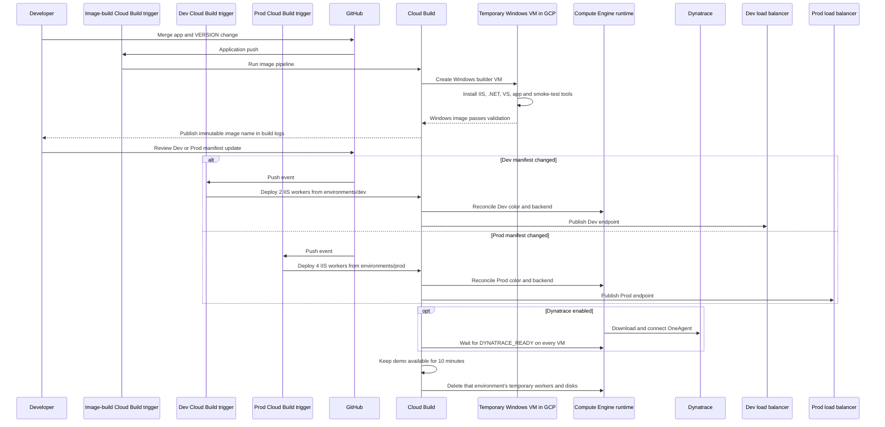

# GitOps blue/green design

## Control flow

Cloud Build is the CI/CD control plane. It runs repository validation on pull
requests, builds images on matching pushes to `main`, and runs deployment
builds when reviewed deployment state changes. The Windows image build and
validation still run inside temporary Windows VMs launched by Cloud Build.

## State ownership

| State | Authority |
| --- | --- |
| Application source and semantic version | `applications/sample/` in Git |
| Environment topology and desired images | `environments/dev/` and `environments/prod/` |
| Built application release | Immutable Compute Engine image |
| Running instances | Dev: 2; Prod: 4 temporary IIS workers, reconciled from Git |
| Traffic selection | Environment backend group selected by `ACTIVE_COLOR` |
| Rollback | Git revert of the promotion commit |
| Demo lifetime | Each environment is torn down 10 minutes after its deployment |
| Dynatrace enablement | Cloud Build trigger substitutions and Secret Manager reference |
| Dynatrace token value | GCP Secret Manager only |
| OneAgent identity | Created independently at runtime on each worker VM |

The image-build trigger never changes either environment directly. Separate
deployment triggers never invent a version; each reconciles its reviewed
manifest and has a dedicated backend service, health check, address, and
frontend. This separation supplies the minimum useful GitOps approval boundary. For this
cost-controlled demonstration, worker VMs are intentionally ephemeral: each
environment's manifest, image, and load-balancer resources remain, while its
workers are removed after the viewing window.
