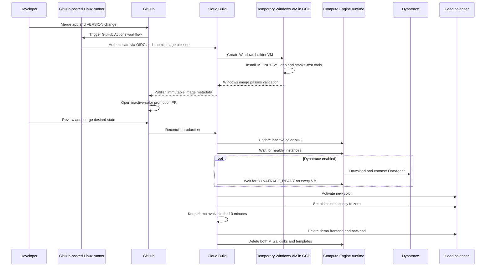

# GitOps blue/green design

## Control flow

The GitHub-hosted runner is Linux-only and performs orchestration. The actual
Windows image build, Windows installation steps, and validation run inside a
temporary Windows VM launched by Cloud Build in GCP.

## State ownership

| State | Authority |
| --- | --- |
| Application source and semantic version | `projects/sample/` in Git |
| Desired blue/green image versions | `environments/prod/deployment.env` |
| Built application release | Immutable Compute Engine image |
| Running instances | Temporary managed instance groups reconciled from Git |
| Traffic selection | Backend capacity derived from `ACTIVE_COLOR` during the demo |
| Rollback | Git revert of the promotion commit |
| Demo lifetime | Automatic teardown 10 minutes after success or failure |
| Dynatrace enablement | GitHub variables and Secret Manager reference |
| Dynatrace token value | GCP Secret Manager only |
| OneAgent identity | Created independently at runtime on each MIG VM |

The image-build workflow never changes production directly. The deployment
workflow never invents a version; it reconciles the reviewed manifest. This
separation supplies the minimum useful GitOps approval boundary. For this
cost-controlled demonstration, runtime state is intentionally ephemeral: the
manifest and image remain, while both MIGs and the load-balancer resources are
removed after the viewing window.
